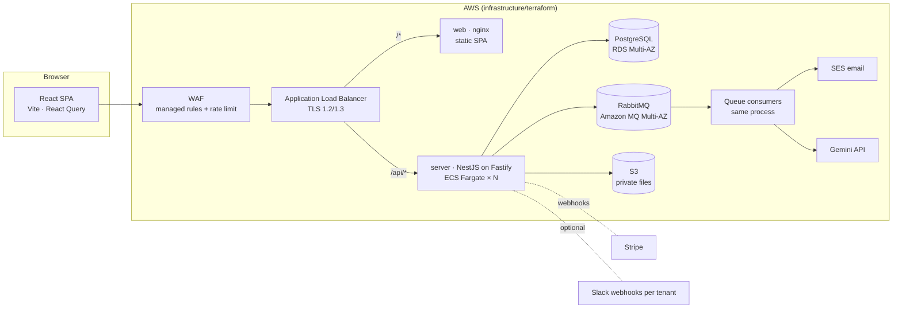
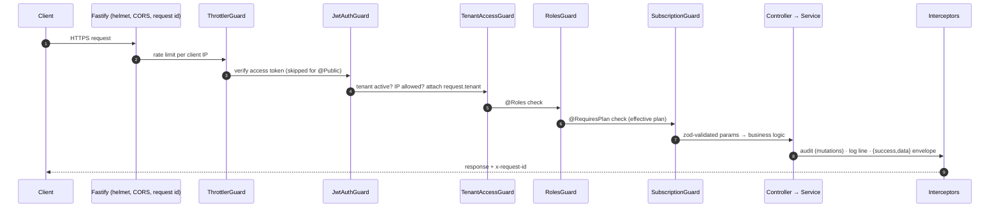
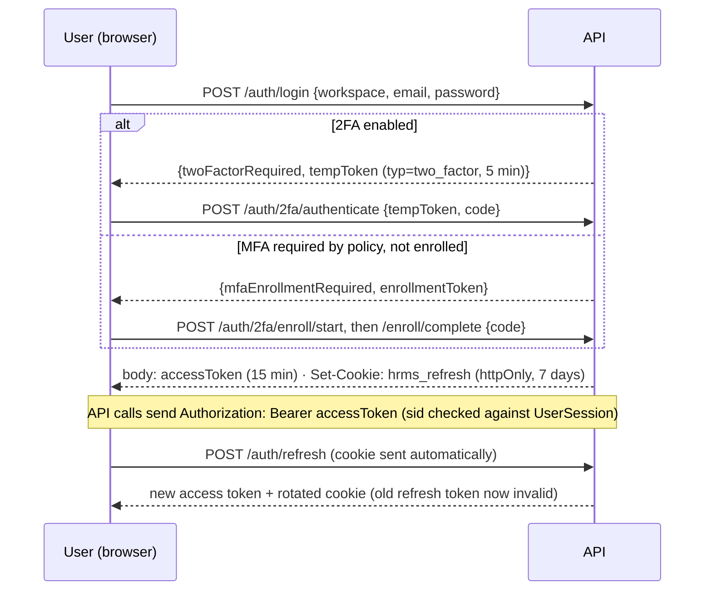
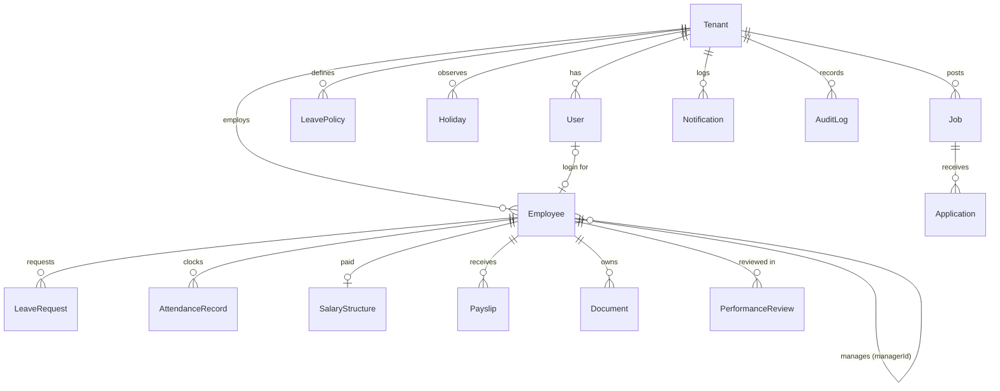

# Architecture

A multi-tenant HRMS delivered as SaaS. One deployment serves many companies ("tenants");
every row of business data belongs to exactly one tenant.

## System overview



| Layer | Technology | Why |
| --- | --- | --- |
| API | NestJS 11 on Fastify, TypeScript | Modules/DI keep features isolated; Fastify is ~2× Express throughput and has first-class multipart streaming |
| Validation | zod | One schema gives runtime validation *and* the TypeScript type; unknown keys are stripped (mass-assignment protection) |
| Database | PostgreSQL 16 via Prisma | Relational data with strong constraints (unique, FK); Prisma migrations are versioned SQL |
| Queue | RabbitMQ on Amazon MQ | Durable email, AI and leave work with publisher confirms, delayed retries and dead-letter queues |
| Files | S3 (private) | Durable, encrypted; files are streamed through authorised endpoints, never public URLs |
| Web | React 18, React Query, Tailwind, Radix UI | Server-state caching, accessible primitives; routes are code-split |
| Infra | Terraform, ECS Fargate, ALB, WAF, Secrets Manager, CloudWatch | Managed, horizontally scalable, no servers to patch |

The API is a **modular monolith**: one deployable, with strict module boundaries. It is the
right shape for this team size — no network hops between features, one database transaction
when a workflow spans modules, and modules can be extracted later if a need appears.

## Code layout

```
apps/
  server/                 NestJS API
    prisma/               schema.prisma, versioned migrations, seed scripts
    src/
      config/env.ts       validated configuration (fails fast on bad/missing env)
      bootstrap.ts        HTTP pipeline shared by main.ts and e2e tests
      common/             cross-cutting infrastructure (see below)
      modules/<feature>/  controller → service → Prisma, plus dto/ schemas
    test/                 e2e suites (security + workflows) against a real DB
  web/                    React SPA (pages/, components/, lib/api.ts)
  e2e/                    Playwright browser smoke tests
infrastructure/
  terraform/              AWS: network, data, ECS, ALB/WAF, IAM, secrets, alarms
  nginx/                  SPA server config, compose-only API proxy, Caddy (TLS)
  scripts/deploy.sh       migrate-then-roll-out ECS deploy
docs/                     this documentation
```

`common/` contents:

| Folder | Responsibility |
| --- | --- |
| `auth/` | `TokenService` (purpose-bound JWTs), `@Public/@Roles/@Permissions/@RequireStepUp/@CurrentUser/@CurrentTenant` decorators, `AuthUser` type, permission map, refresh/SSO cookies, session cache, replay guard |
| `guards/` | Global guard chain (below) and `EmployeeLimitGuard` |
| `tenant/` | `TenantContextService` — cached tenant snapshot (suspension, IP allow-list, plan) |
| `crypto/` | AES-256-GCM field encryption |
| `storage/` | S3 / local object storage with tenant-prefixed keys |
| `files/` | Upload validation by magic bytes |
| `email/` | Escaped templates, queue producer, SES worker |
| `audit/` | Audit service, interceptor, `/audit` endpoint |
| `filters/`, `interceptors/` | Error envelope, request logging, success envelope |
| `subscription/` | Plan hierarchy, limits and the access policy (pure functions) |
| `utils/`, `validation/` | Date maths, IP matching, shared zod schemas, pagination |

## Request lifecycle

Every HTTP request passes through the same pipeline, in this order:



* **Default deny.** `JwtAuthGuard` is global; a route is public only if it is explicitly marked
  `@Public()`. A new endpoint cannot ship unauthenticated by accident.
* **Order matters.** Tenant checks need `request.user` (from JWT), plan checks need
  `request.tenant` (from the tenant guard). Registering them globally in this order in
  `app.module.ts` makes the dependency explicit.
* **Errors** from anywhere are converted by `GlobalExceptionFilter` into
  `{ success:false, statusCode, code, message, errors?, requestId, timestamp }`. Prisma
  unique violations become 409, missing records 404; unexpected errors are logged with the
  request id, sent to Sentry, and the client sees a generic message.

## Multi-tenancy

**Model:** shared database, shared schema, `tenantId` column on every business table
(indexed). This is the most cost-effective model and the standard choice for SMB SaaS.

**How isolation is enforced:**

1. The tenant comes only from the **verified access token** — never from a header, query
   parameter or request body.
2. `JwtStrategy.validate` **fails closed**: a token without a string `tenantId` (or with the
   wrong `typ`) is rejected. This matters because Prisma treats `where: { tenantId: undefined }`
   as *no filter* — the original codebase leaked every tenant's data this way.
3. Every service query filters by `user.tenantId`. Lookups by id use
   `findFirst({ where: { id, tenantId } })` and return **404** (not 403) for other tenants'
   ids, so an attacker cannot even confirm a record exists.
4. Object-storage keys are prefixed `tenants/<tenantId>/…`.
5. The e2e suite (`test/security.e2e-spec.ts`) creates two tenants and proves cross-tenant
   reads and writes fail.

**Considered and deferred:** PostgreSQL Row-Level Security as a second layer. It needs a
per-request `SET app.tenant_id` inside a transaction, which complicates Prisma usage; the
application-layer controls plus tests are sufficient at this stage (see
[PRODUCTION_PLAN.md](PRODUCTION_PLAN.md#4-roadmap)).

## Authentication & sessions



* **Purpose-bound tokens.** `TokenService` issues nine token types (access, refresh,
  two_factor, mfa_enroll, step_up, invite, reset, sso_state, sso_exchange). Each is signed
  with its own key derived via HMAC from `JWT_SECRET` *and* carries a `typ` claim, so a
  password-reset link can never be replayed as an API token.
* **Revocation via `tokenVersion`.** Refresh, invite, reset, 2FA and SSO tokens embed the
  user's `tokenVersion`. Bumping it (password change/reset, offboarding, role change, MFA
  reset) invalidates all of them at once. Invite/reset links are therefore single-use.
* **Refresh token never reaches page script.** It lives in an httpOnly, SameSite=Strict
  cookie scoped to `/api/v1/auth`.
* **Refresh rotation with reuse detection.** Only a SHA-256 hash of the current refresh token
  is stored and rotation is a compare-and-swap. Presenting an older (already rotated) token
  revokes the session — the signature of a stolen token. Tabs serialize refreshes so normal
  use never looks like reuse.
* **Near-instant revocation.** Each access token carries its session id; the API checks the
  session is still active (30 s per-instance cache, cleared immediately where revoked).
* **Step-up.** Sensitive routes (`@RequireStepUp()`) need a fresh MFA/password confirmation
  bound to the same session.
* **Account lockout** after 5 failed password/MFA/step-up attempts for 15 minutes;
  timing-equalised responses for unknown users.

Details: [modules/auth.md](modules/auth.md).

## Authorisation model

| Role | Scope |
| --- | --- |
| `EMPLOYEE` | Own records; company directory fields only |
| `MANAGER` | Employee rights + direct reports (leave approval, team reviews, attendance roster), recruiting pipeline |
| `ADMIN` | Everything inside their tenant (HR/payroll admin) |
| `SUPER_ADMIN` | Platform operators, in a dedicated `platform` workspace; `/platform/*` only. No implicit bypass of tenant rules |

Coarse rules use `@Roles(...)`; relationship rules ("own record", "direct manager",
"not your own leave") live in services, next to the data they depend on.

## Data model (core)



* A **User** is a login; an **Employee** is an HR record. Not every employee has a login
  (e.g. before they are invited), and platform operators have no employee record.
* Money is `DECIMAL(12,2)`; payroll maths runs in integer minor units.
* Calendar dates (leave, attendance, holidays) are `DATE`/UTC-midnight and computed in the
  tenant's timezone.
* Full schema with comments: `apps/server/prisma/schema.prisma`.

## Asynchronous work

| Queue | Producer | Worker | Retry policy |
| --- | --- | --- | --- |
| `hrms.email` | `EmailService.send` (auth, leave, hiring, announcements) | `EmailProcessor` → SES | 5 attempts, exponential backoff from 30 s; recoverable notification claim |
| `hrms.hiring` | Hiring outbox | `HiringProcessor` → PDF text → Gemini | 3 attempts, exponential backoff from 60 s |
| `hrms.leave-processing` | Leave scheduler | Leave entitlement/accrual worker | 5 attempts, exponential backoff from 60 s |

Workers run inside the API process (simplest to operate). If queue load grows, the same
image can run as a separate "worker" ECS service.

## Observability

* **Logs:** one structured JSON line per request (method, path without query string, status,
  latency, request id, tenant id, user id) shipped to CloudWatch. Request bodies are never
  logged.
* **Request ids:** generated (or taken from `x-request-id`), returned in every response and
  error body — support can find the exact log line from a user's screenshot.
* **Errors:** Sentry (optional, `SENTRY_DSN`) with `sendDefaultPii: false`.
* **Health:** `/health` (liveness), `/health/ready` (DB + RabbitMQ), and `/health/queues`.
* **Alarms:** API 5xx, latency, no healthy hosts, DB CPU/storage and RabbitMQ backlog → SNS email;
  terminal outbox/dead-letter failures are reported to Sentry
  (`infrastructure/terraform/monitoring.tf`).
* **Audit trail:** see [modules/audit.md](modules/audit.md).

## Configuration

All configuration is environment variables validated at boot by `src/config/env.ts`.
Production refuses to start with local file storage, log-only email, a non-HTTPS frontend
URL, a JWT secret under 32 characters or a malformed encryption key. See
[DEPLOYMENT.md](DEPLOYMENT.md#configuration-reference).
