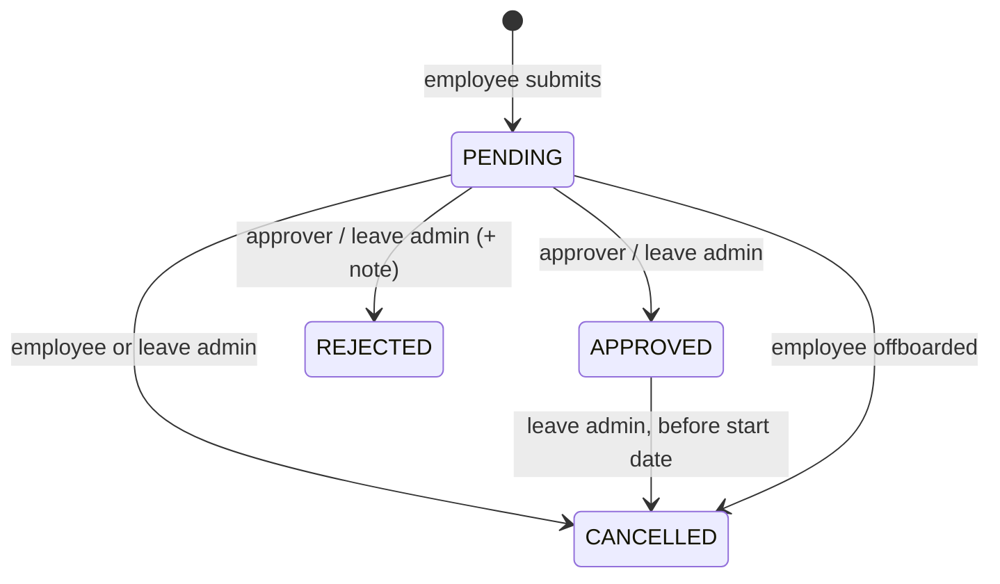

# Leave module

`apps/server/src/modules/leaves`

## Purpose
Leave policies, company holidays, requests, balances and manager approvals.

## Data
* `LeavePolicy` plus immutable `LeavePolicyVersion` records — future-dated entitlement changes;
  submitted requests retain the precise policy snapshot used at submission. Defaults
  remain ANNUAL 18, SICK 12, CASUAL 6, UNPAID; unpaid days feed payroll loss-of-pay.
* `Holiday(tenantId, date, name)`.
* `LeaveRequest`: `type`, `startDate`, `endDate`, `days` (working days), `status`
  (`PENDING | APPROVED | REJECTED | CANCELLED`), `reviewedById`, `reviewedAt`, `reviewNote`,
  a client idempotency key and an immutable policy snapshot.
* `LeaveBalanceLedger`: append-only opening-balance, reservation, release, consumption and
  adjustment events. Positive entries add available leave; negative entries consume it.
* `LeaveApproval`: immutable decision history. The current direct-manager workflow writes step
  one, leaving a safe path for multi-step approval flows.

## Lifecycle

## Endpoints

| Method & path | Access | Notes |
| --- | --- | --- |
| `GET /leave-requests?scope=mine\|team\|all&status` | user / `leave.review` / `leave.admin` | `team` = direct reports; `all` = leave admins only |
| `GET /leave-requests/balance?year&employeeId` | self, reviewer, `leave.admin` | quota, used, pending, remaining per type |
| `POST /leave-requests` | user | `employeeId` only for `leave.admin` filing on behalf |
| `PATCH /leave-requests/:id/status` | configured approver / `leave.admin` | approve / reject with note |
| `POST /leave-requests/:id/cancel` | owner / `leave.admin` | |
| `GET /leave-policies` · `PUT /leave-policies` | user · `leave.admin` | upsert a type |
| `GET /leave-policies/:type/versions` | `leave.admin` | immutable entitlement-policy history |
| `GET /holidays?year` · `POST /holidays` · `DELETE /holidays/:id` | user · `leave.admin` · `leave.admin` | |
| `POST /leave-accruals/run` | `leave.admin` / scheduler | Idempotently award one month for `MONTHLY` policies |
| `POST /leave-carry-forward/run` | `leave.admin` / scheduler | Idempotently carry a bounded unused balance into next year |
| `POST /leave-balance-adjustments` | `leave.admin` | Append-only, idempotent credit/debit with a required reason |
| `GET /leave-approval-rules` · `PUT /leave-approval-rules` | `leave.admin` | configure sequential direct-manager, role, or named-user steps |

## Rules
* **Working days** are computed server-side: Mon–Fri minus tenant holidays. The client never
  supplies the day count.
* **Validation:** end ≥ start; not across a year boundary (split into two); at most one year ahead;
  at least one working day.
* **No overlaps** with the employee's pending/approved leave (409).
* **Balance check** is performed in a PostgreSQL serializable transaction. Paid requests create
  an immediate ledger reservation, and retries use `requestKey`, so concurrent submissions cannot
  overspend a balance or create duplicate requests after a client timeout.
* **Approval rights:** configured approvers or `leave.admin` — never yourself.
* **Race-safe approval:** the status change and its ledger conversion happen in one serializable
  transaction. A reservation is converted to consumption when approved, or released when
  rejected/cancelled; a duplicate decision receives 409.
* On decision: email to the employee, per-tenant Slack message (best effort), audit entry.
* Entitlement changes create a future-dated immutable policy version. The prior version is closed
  the day before the replacement begins, preventing historical balances from being rewritten.
* Approval routing is snapshotted at submission. A request stays `PENDING` until every configured
  step approves; rejection at any step releases its reservation. Administrators retain a documented
  override, while named approvers and role-based approvers are checked by the service.
* A direct manager or named approver can delegate approval to another active tenant user for a
  date-bounded period. Delegation does not alter the original workflow record.
* Each rule can set a reminder and escalation threshold. The daily worker queues each follow-up
  exactly once; escalations notify active tenant administrators.
* Leave cannot be submitted, finalized, or cancelled when it overlaps a finalized payslip. This
  prevents silent retroactive payroll changes; such cases require a controlled payroll correction.
* The current calendar is Monday–Friday with tenant holidays. Fractional-day, hour-based,
  jurisdiction-specific accrual and statutory rules are intentionally not exposed until their
  policy semantics and payroll treatment are configured for the tenant.
* A RabbitMQ-backed daily worker runs monthly accruals for every active tenant and retries carry-forward
  during the first seven days of January. Every ledger event is idempotent, so restarts are safe.
* Production monitoring should scrape `GET /health/queues` and alert on RabbitMQ dead-letter queues
  (`hrms.email.dead`, `hrms.hiring.dead`, and `hrms.leave-processing.dead`).

## Tests
Workflows: working-day count, overlap 409, balance includes pending, employee cannot approve,
manager sees team queue, double decision → 409. Unit: `dates.spec.ts` (working days, holidays,
timezones, leap years).

## Interview talking points
* Conditional update for concurrency without explicit locks.
* Why balances count pending requests.
* Storing dates as calendar dates (not instants) to avoid off-by-one timezone bugs.
