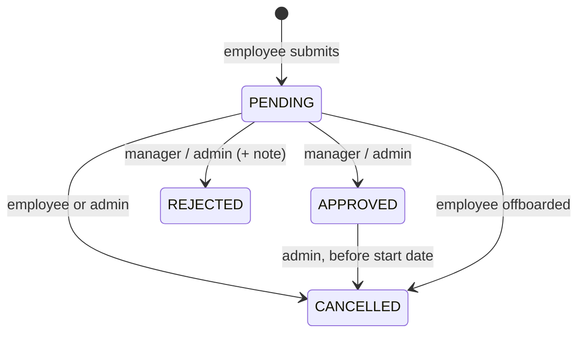

# Leave module

`apps/server/src/modules/leaves`

## Purpose
Leave policies, company holidays, requests, balances and manager approvals.

## Data
* `LeavePolicy(tenantId, type, annualQuota, isPaid)` — defaults per new tenant: ANNUAL 18,
  SICK 12, CASUAL 6, UNPAID (unpaid days feed payroll loss-of-pay).
* `Holiday(tenantId, date, name)`.
* `LeaveRequest`: `type`, `startDate`, `endDate`, `days` (working days), `status`
  (`PENDING | APPROVED | REJECTED | CANCELLED`), `reviewedById`, `reviewedAt`, `reviewNote`.

## Lifecycle

## Endpoints

| Method & path | Access | Notes |
| --- | --- | --- |
| `GET /leave-requests?scope=mine\|team\|all&status` | user / MANAGER / ADMIN | `team` = direct reports; `all` = admins only |
| `GET /leave-requests/balance?year&employeeId` | self, manager, admin | quota, used, pending, remaining per type |
| `POST /leave-requests` | user | `employeeId` only for admins filing on behalf |
| `PATCH /leave-requests/:id/status` | MANAGER, ADMIN | approve / reject with note |
| `POST /leave-requests/:id/cancel` | owner / ADMIN | |
| `GET /leave-policies` · `PUT /leave-policies` | user · ADMIN | upsert a type |
| `GET /holidays?year` · `POST /holidays` · `DELETE /holidays/:id` | user · ADMIN · ADMIN | |

## Rules
* **Working days** are computed server-side: Mon–Fri minus tenant holidays. The client never
  supplies the day count.
* **Validation:** end ≥ start; not across a year boundary (split into two); at most one year ahead;
  at least one working day.
* **No overlaps** with the employee's pending/approved leave (409).
* **Balance check** for paid types counts **approved + pending**, so an employee cannot submit
  several requests that together exceed the quota.
* **Approval rights:** the employee's *direct manager* or an admin — never yourself.
* **Race-safe approval:** the status change is `updateMany … WHERE status = 'PENDING'`; if two
  approvers act at once, only one update succeeds and the other gets 409.
* On decision: email to the employee, per-tenant Slack message (best effort), audit entry.

## Tests
Workflows: working-day count, overlap 409, balance includes pending, employee cannot approve,
manager sees team queue, double decision → 409. Unit: `dates.spec.ts` (working days, holidays,
timezones, leap years).

## Interview talking points
* Conditional update for concurrency without explicit locks.
* Why balances count pending requests.
* Storing dates as calendar dates (not instants) to avoid off-by-one timezone bugs.
