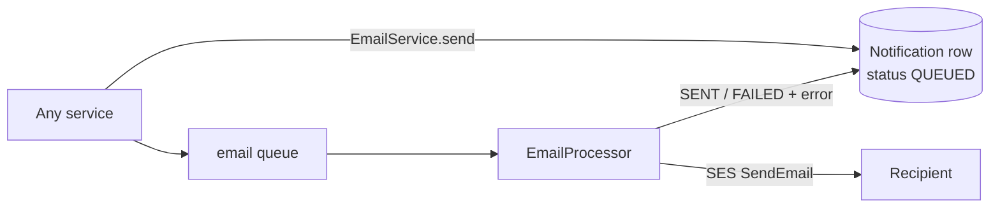

# Notifications & email

`apps/server/src/modules/notifications` · `common/email/*`

## Purpose
In-app inbox, the email delivery log, admin announcements, and the transactional email
pipeline used by every module.

## Email pipeline

* Templates (`templates.ts`) **escape every interpolated value** and include a plain-text part.
* 5 attempts with exponential backoff; the Notification row shows the real outcome (the
  original marked failed sends as SENT).
* `sensitive: true` (invites, resets) stores a **redacted** body and completed jobs are removed
  from Redis, so credential links can't be read back later. (The original stored reset links
  in a table every employee could list — an account-takeover path.)
* `EMAIL_DRIVER=log` prints emails in development; production requires `ses`.

## Endpoints

| Method & path | Access | Notes |
| --- | --- | --- |
| `GET /notifications?scope=mine\|all` | user / ADMIN | `mine` = sent to me; `all` = delivery log |
| `POST /notifications/:id/read` | recipient | in-app only |
| `POST /notifications/compose-email` | ADMIN, 30/min | recipient must be an active member of the workspace |
| `POST /notifications/announce` | ADMIN, 5/hour | whole company or one department; in-app + email; ≤ 1000 recipients |

## Rules
* **No open relay:** only admins can compose, and only to their own workspace's people. The
  original let any employee email anyone from the company's domain.
* Rich text from the editor is sanitised with an allow-list (no scripts, styles, iframes,
  event handlers; links limited to https/mailto and forced `rel="noopener noreferrer"`).

## Tests
Security: employees 403, admins cannot email outsiders, credential links absent from logs.
Unit: sanitiser and template escaping.
