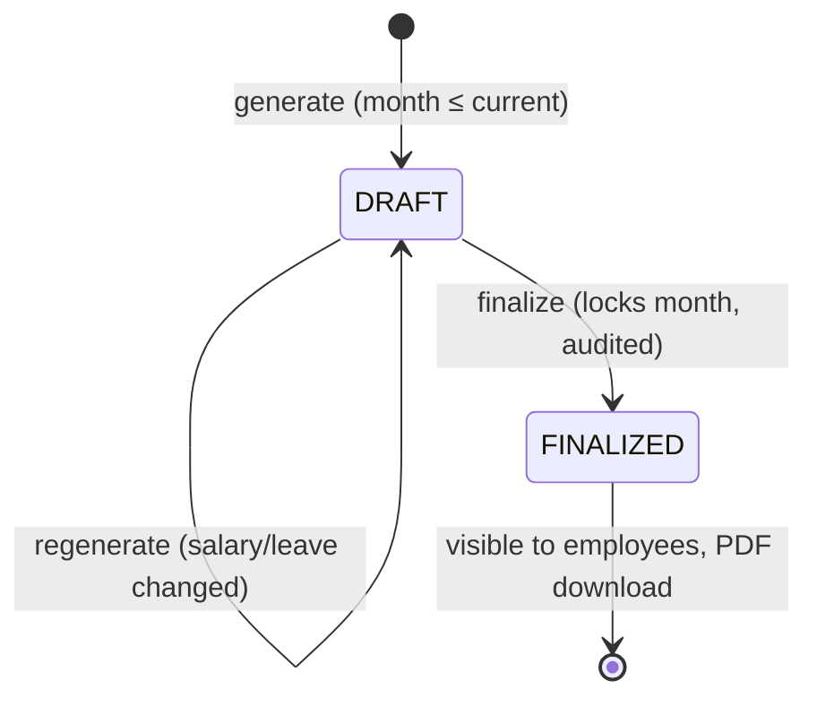

# Payroll module

`apps/server/src/modules/payroll` — `payroll.calculator.ts` (pure maths), `payroll.service.ts`, `payslip-pdf.ts`

## Purpose
Monthly salary structures, payroll runs with a draft → finalize lifecycle, and payslip PDFs.

## Data
* `SalaryStructure` (monthly): `baseSalary`, `allowances`, `deductions` (other fixed, e.g.
  professional tax), `monthlyTds`, `pfEnabled`. `DECIMAL(12,2)`.
* `Payslip(employeeId, month, year)` unique: `payableDays`, `lopDays`, `basicPay`,
  `allowances`, `grossPay`, `pfDeduction`, `tdsDeduction`, `deductions` (total), `netPay`,
  `status` (`DRAFT | FINALIZED`), `finalizedAt`.

## Lifecycle

## Calculation (`calculatePayslip`)
All arithmetic in integer minor units (paise/cents) — no floating-point drift.

1. **Loss of pay (LOP)** = approved *unpaid* leave (working days in the month) + calendar days
   before joining / after exit.
2. `payableDays = daysInMonth − LOP`; basic and allowances are pro-rated by `payableDays / daysInMonth`.
3. **PF** = 12 % of earned basic, capped at the ₹15,000 statutory wage ceiling (max 1,800),
   if `pfEnabled`.
4. **TDS** = `monthlyTds` entered by the payroll admin (0 if nothing is payable).
   *Income tax is deliberately not computed*: it depends on the tax regime, declarations and a
   full-year projection. Pretending with a flat 10 % (as the original code did) would produce
   wrong payslips.
5. `net = gross − (PF + TDS + other)`. If deductions exceed gross, net is capped at 0 and a
   warning is returned for review.

Worked example (tested): basic 30,000, allowances 10,000, other 200, TDS 1,500 →
gross 40,000; PF 1,800; deductions 3,500; **net 36,500**.

## Endpoints

| Method & path | Access | Plan |
| --- | --- | --- |
| `GET /payroll/my-payslips` | user (FINALIZED only) | BASIC |
| `GET /payroll/payslips/:id/pdf` | owner (finalized) or ADMIN | BASIC |
| `GET /payroll/salaries` | ADMIN | BASIC |
| `PUT /payroll/salaries/:employeeId` | ADMIN — audited with old/new values | BASIC |
| `GET /payroll/runs?month&year` | ADMIN — totals + payslips + status | BASIC |
| `POST /payroll/runs/generate` | ADMIN | BASIC |
| `POST /payroll/runs/finalize` | ADMIN — audited | BASIC |

## Rules
* Future months cannot be run; finalized months cannot be regenerated (409).
* Drafts are invisible to employees.
* Response includes `employeesWithoutSalary` and per-employee warnings so nothing is silently skipped.
* PDFs are rendered in memory (pdfkit) — nothing written to disk, no public URLs.

## Tests
Unit (`payroll.calculator.spec.ts`): full month, PF ceiling, PF off, LOP pro-rating, no float
artefacts, LOP clamp, negative-net cap. Workflows: exact figures end-to-end, drafts hidden,
finalize lock, PDF bytes, manager cannot download others' payslips.

## Limitations / roadmap
Employer PF/ESI contributions, professional tax slabs per state, tax projection, bank payment
files, arrears and reimbursements. The calculator is a pure function, so each can be added with
unit tests first.
