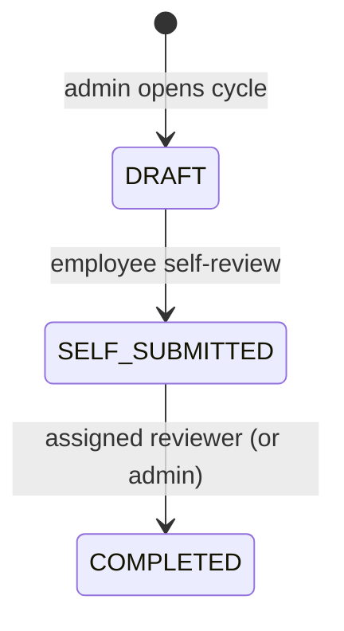

# Performance module

`apps/server/src/modules/performance`

## Purpose
Review cycles with self-assessment followed by manager assessment.

## Data
`PerformanceReview(tenantId, employeeId, cycleName)` unique; `reviewerId` (the manager when the
cycle opened), `selfRating`, `selfComments`, `managerRating`, `managerComments`, `status`,
`submittedAt`, `completedAt`.

## Endpoints (plan: BUSINESS)

| Method & path | Access |
| --- | --- |
| `GET /performance/me` | user |
| `GET /performance/team` | MANAGER / ADMIN — reviews assigned to me |
| `GET /performance/all?cycleName` | ADMIN |
| `GET /performance/cycles` | ADMIN — progress per cycle |
| `POST /performance/cycle` | ADMIN — idempotent (`createMany … skipDuplicates`) |
| `PATCH /performance/:id/self` | the employee, only in DRAFT |
| `PATCH /performance/:id/manager` | assigned reviewer or ADMIN, only in SELF_SUBMITTED, never own review |

## Rules
* Ratings 1–5; comments ≤ 4000 chars; separate self and manager comments.
* Opening a cycle twice only adds employees who joined since; the response reports employees
  without a manager so HR can fix reporting lines.

## Tests
Workflows: reviewer assignment, out-of-order manager review → 409, full completion.
